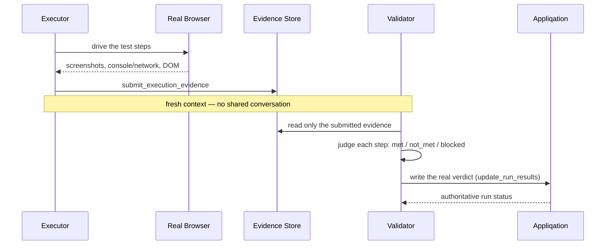

# Appliqation Autotest

**Autonomously executes a test case in a real browser, then has a second, independent AI judge the result from evidence alone — never from the first agent's own claim.**

Point it at one test case, a whole scenario, or a whole test set (regression/sanity/smoke — the most common CI shape), and it drives a real Playwright browser, captures real evidence (screenshots, console/network logs, accessibility snapshots), and writes an honest, appq-polled verdict back to Appliqation. No fabricated pass/fail — a validator that can't confirm something reports `blocked`, not a guess.

## Why two agents, not one

A single model that both executes a test and grades its own execution is grading its own homework. This repo genuinely separates the two roles — **executor** and **validator** each run as their own fresh, isolated tool-calling loop with no shared context between them. The validator never sees the executor's reasoning, only what it explicitly submitted as evidence via `submit_execution_evidence`. That's the entire mechanism behind trustworthy self-verification here: isolation, not a prompt asking the model to "be objective."

## How it works



- **Verdicts are polled, not parsed.** The final status comes from Appliqation's own run matrix (`get_test_results`), not scraped out of the validator's report prose.
- **A destructive-action gate** blocks any click matching a destructive-verb/`mailto:`/`tel:`/`sms:` pattern before it ever dispatches — checked in code, not left to the model to notice.
- **Per-TC role inference.** Mixed-role scenarios (admin sees X, standard user gets 403 on the same page) get the right authenticated session per test case automatically, from each TC's own tag or name — no manual per-run role juggling.

## Quick start

```bash
npm install -g @appliqation/autotest
npx playwright install chromium
```

Create a `.env` file (in whatever directory you'll run it from) with:

```
APPQ_API_KEY=your-appliqation-api-key
ANTHROPIC_API_KEY=your-anthropic-key   # or OPENAI_API_KEY — pick one
```

```bash
# one test case
appliqation-autotest judge --test-case-uuid <uuid> --environment Stage --dry-run

# an entire scenario
appliqation-autotest judge --scenario-id <id> --environment Stage --dry-run

# a whole test set (regression / sanity / smoke — the common CI shape; can span multiple scenarios)
appliqation-autotest judge --test-set-id <id> --environment Stage --dry-run
```

Exactly one of `--test-case-uuid` / `--scenario-id` / `--test-set-id` is required — mutually exclusive scopes, not combinable.

`--dry-run` is the recommended default for your first run against a real project — it computes real verdicts but suppresses the actual Appliqation writeback. Drop it once you trust the result. `--coverage` (`always` / `on-script-absence` / `sampled:N` / `external`) controls when this agentic pass runs alongside your existing deterministic Playwright pipeline in scenario/test-set mode; `--json`/`--ci` give a structured summary and a CI-friendly exit code.

## CLI reference

`appliqation-autotest judge [options]`

**Scope — exactly one required:**

| Option | Description |
|---|---|
| `--test-case-uuid <uuid>` | One test case to judge. `scenario_id` is always derived from it — `--scenario-id` is not accepted alongside it. |
| `--scenario-id <id>` | An entire scenario, agentic pair judged per TC per the coverage policy. |
| `--test-set-id <id>` | An entire test set (can span multiple scenarios, the common regression/sanity/smoke shape) — gets exactly one shared run covering every TC in it. `--run-id` is not supported in this mode. |

**Required:**

| Option | Description |
|---|---|
| `--environment <name>` | Environment name — its URL is what the browser navigates to. |

**Optional:**

| Option | Description |
|---|---|
| `--run-id <id>` | Reuse an existing run instead of creating one. Not available in test-set mode. |
| `--role <name>` | Authenticate the executor as this role before navigating, using the Playwright storageState `appq-auth-setup` writes. Omit for ungated projects. |
| `--coverage <policy>` | `always` \| `on-script-absence` (default) \| `on-failure-or-absence` \| `sampled:N` \| `external` — only meaningful in whole-scenario/test-set mode; decides when the agentic pair runs alongside the deterministic canonical-script pipeline. |
| `--test-type <ui\|api>` | Force `ui` (browser) or `api` (`http_request`) execution for every TC this invocation touches. Omit and each TC's own tag decides instead. |
| `--poll-timeout-ms <ms>` | Whole-scenario/test-set mode: how long to wait for the deterministic path to settle before reporting. Defaults to `POLL_TIMEOUT_MS`. |
| `--mandatory-image-check` | Fetch and attach every step's screenshot to the validator unconditionally, instead of leaving it to the model's own `view_screenshot` judgment. Real cost/reliability tradeoff, not free. |
| `--dry-run` | Compute verdicts normally but suppress the actual `update_run_results`/`create_defect` calls — logs what would have been sent instead. |
| `--json` | Print the final result as a single JSON object instead of a human-readable table. |
| `--ci` | Shorthand for `--json`. |

## Configuration

Copy `.env.example` to `.env`. Requires `APPQ_API_KEY` and one of `ANTHROPIC_API_KEY`/`OPENAI_API_KEY`. Separate executor/validator model overrides are supported — a cheaper model for judging captured evidence is a reasonable choice even when the executor needs a stronger one for open-ended browsing.

## Running this safely

The executor drives a real browser turn by turn on the model's own decisions — where to navigate, what to click, what to inspect — against whatever page content the site under test happens to serve. The destructive-action gate on `browser_click`/`browser_evaluate` (see `@appliqation/agent-core`'s `destructiveActionGate.ts`) blocks the obvious failure mode, but it's a code-level backstop, not a substitute for containment: this process holds `APPQ_API_KEY`, your LLM provider key, and (for authenticated runs) real project credentials, all reachable from wherever the model decides to navigate.

**Run this inside a container with an egress allowlist**, not directly on a machine with broad network access. This process only ever legitimately needs to reach:

- your LLM provider (`api.anthropic.com` or `api.openai.com`)
- your configured `APPQ_ORIGIN` (`appq.appliqation.io` by default)
- the project's own site under test — whatever URL `--environment` resolves to via `get_project_settings`

Anything else this process tries to reach is unexpected and worth investigating, not routing around.

## Development

```bash
git clone https://github.com/appliqation/autotest.git
cd autotest
npm install
cp .env.example .env   # fill in APPQ_API_KEY and one LLM provider key
npm run dev -- judge --test-case-uuid <uuid> --environment <name>
npm run typecheck
npm test
```

See `CLAUDE.md` for a map of this repo if you're working in it with an AI coding assistant.

## License

MIT — see [LICENSE](./LICENSE).
