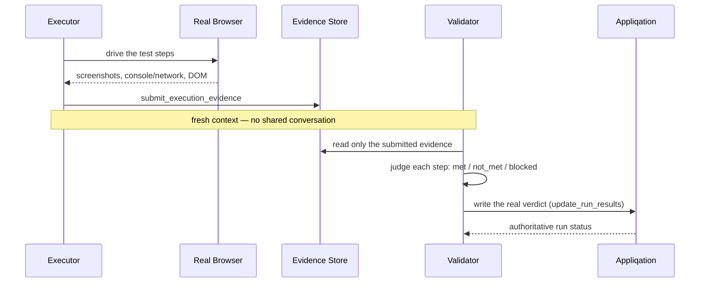

# Appliqation Autotest

**Autonomously executes a test case in a real browser, then has a second, independent AI judge the result from evidence alone — never from the first agent's own claim.**

Point it at one test case, a whole scenario, or a whole test set (regression/sanity/smoke — the most common CI shape), and it drives a real Playwright browser, captures real evidence (screenshots, console/network logs, accessibility snapshots), and writes an honest, appq-polled verdict back to Appliqation. No fabricated pass/fail — a validator that can't confirm something reports `blocked`, not a guess.

## Why two agents, not one

A single model that both executes a test and grades its own execution is grading its own homework. This repo genuinely separates the two roles — **executor** and **validator** each run as their own fresh, isolated tool-calling loop with no shared context between them. The validator never sees the executor's reasoning, only what it explicitly submitted as evidence via `submit_execution_evidence`. That's the entire mechanism behind trustworthy self-verification here: isolation, not a prompt asking the model to "be objective."

## How it works



- **Verdicts are polled, not parsed.** The final status comes from Appliqation's own run matrix (`get_test_results`), not scraped out of the validator's report prose.
- **A destructive-action gate** blocks any click matching a destructive-verb/`mailto:`/`tel:`/`sms:` pattern before it ever dispatches — checked in code, not left to the model to notice.
- **Per-TC role inference.** Mixed-role scenarios (admin sees X, standard user gets 403 on the same page) get the right authenticated session per test case automatically, from each TC's own tag or name — no manual per-run role juggling.

## Quick start

```bash
git clone https://github.com/appliqation/appliqation-autotest.git
cd appliqation-autotest
npm install
cp .env.example .env   # fill in APPQ_API_KEY and one LLM provider key
npm run build
```

```bash
# one test case
npx appliqation-autotest judge --test-case-uuid <uuid> --environment Stage --dry-run

# a whole test set (regression / sanity / smoke — the common CI shape)
npx appliqation-autotest judge --test-set-id <id> --environment Stage --dry-run
```

`--dry-run` is the recommended default for your first run against a real project — it computes real verdicts but suppresses the actual Appliqation writeback. Drop it once you trust the result. `--coverage` (`always` / `on-script-absence` / `sampled:N` / `external`) controls when this agentic pass runs alongside your existing deterministic Playwright pipeline in scenario/test-set mode; `--json`/`--ci` give a structured summary and a CI-friendly exit code.

## Configuration

Copy `.env.example` to `.env`. Requires `APPQ_API_KEY` and one of `ANTHROPIC_API_KEY`/`OPENAI_API_KEY`. Separate executor/validator model overrides are supported — a cheaper model for judging captured evidence is a reasonable choice even when the executor needs a stronger one for open-ended browsing.

## Development

```bash
npm run dev -- judge --test-case-uuid <uuid> --environment <name>
npm run typecheck
npm test
```

See `CLAUDE.md` for a map of this repo if you're working in it with an AI coding assistant.

## License

MIT — see [LICENSE](./LICENSE).
